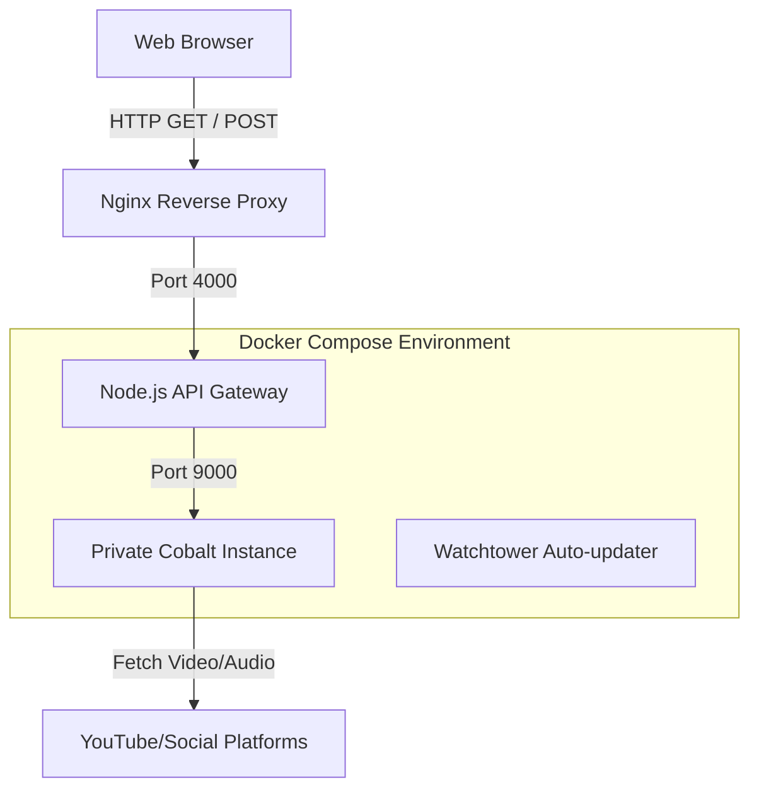

# MP4YT Infrastructure Documentation

## 1. Architecture Diagram

## 2. API Documentation
The API Gateway exposes the following endpoints:

### `GET /health`
Returns the health status of the API Gateway.
**Response**: `{"status": "ok", "timestamp": "2026-08-04T12:00:00.000Z"}`

### `POST /api/extract`
Proxies extraction requests to the internal Cobalt instance.
**Payload Requirements:**
- `url` (string, required): The URL of the video to extract.
- `quality` (string, optional): Target quality, e.g., '1080', 'best'.
- `mode` (string, optional): 'auto' (video+audio) or 'audio'.

### `GET /tunnel`
Proxies tunneled streams directly from Cobalt back to the user, keeping Cobalt's true internal address entirely hidden from the frontend.

## 3. Maintenance Guide
- **Log Management**: The API Gateway uses Pino structured JSON logging. You can view logs by running `docker logs mp4yt-backend`.
- **System Monitoring**: Periodically check `docker stats` to ensure memory/CPU usage is within acceptable ranges.

## 4. Upgrade Guide
The `watchtower` container automatically updates the `cobalt` image in the background. 
To manually update the API Gateway:
1. Make changes to the `backend/` source code.
2. Run `docker compose -f docker-compose.prod.yml up -d --build backend`.

## 5. Troubleshooting Guide
- **Extraction Failures**: Check `docker logs mp4yt-backend` for timeouts or rate limits. If Cobalt itself is failing, check `docker logs cobalt`. 
- **Cobalt DNS Issues**: On Ubuntu, if Cobalt is failing to resolve URLs, ensure `nscd` is installed: `sudo apt install nscd && sudo service nscd start`.
- **Rate Limits**: If users complain about "Too many requests", adjust the `express-rate-limit` configuration in `backend/server.js`.

## 6. Disaster Recovery Guide
- **Stateless Infrastructure**: The backend and Cobalt do not hold state (no databases).
- **Recovery Procedure**: If the VPS dies, provision a new VPS, clone the repo, copy your backup of the `.env` file, and run `docker compose up -d --build`. Service will be restored instantly.
